# VE216 Lecture 1

## Function reformation notice!

$f(x) \rightarrow f(ax+b)$, how will the function change?

1.  $f(x) \rightarrow f(ax+b)$, thus we know how to change:

-   move the center of $f(x)$ according to $b$: if $b > 0$, then move to left side with length $b$; otherwise, move right side with length $b$.

-   check the $a$, change the $x-axis$ $\frac{1}{a}$ times according to $y-axis$.

2.  or we can see $f(x) \rightarrow f(a(x + \frac{b}{a}))$, thus get a result:

-   move $f(x)$ according to the $\frac{b}{a}$, if positive left side, otherwise right side.
-   change according to the center of $f(x)$ by the $x-axis$ with $\frac{1}{a}$ times.

These are two methods needed to be remembered.

# VE216 Lecture 2

## Multiple Representations of Discrete Time Systems

>   Verbal description.

>   Block diagram: try the step-by-step analysis to solve the problem.
>
>   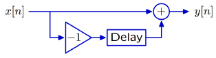

>   Difference equation: mathematically precise and compact.
>
>   $$y[n] = x[n] - x[n-1]$$

>   Operator representation.
>
>   $$Y=(1-R)X$$

-   **Delay**: make $x[n]$ into $x[n-1]$ or $X$ into $RX$.
-   **Value**: set it $k$ in triangle symbol, let $x[n]$ into $k\cdot x[n]$ and $X$ into $k\cdot X$.

Notice that on a subline, with a $-1$ and **Delay**, so these should be **multiplied by** $-1$ or $R$ or something else, to get a $-RX$ or $-x[n-1]$ on that subline.

Also, the whole system are assumed commonly by start at rest.

## Operators and Operator Notation

**Delay**: $R\rightarrow Y = R\{X\} \equiv RX \rightarrow (y[n] \rightarrow y[n-1])$

**Value**: $p \rightarrow Y = p\cdot X \rightarrow (y[n] \rightarrow p\cdot y[n])$

## Operator of Cascaded System

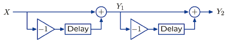

Then we see $Y_2 = (1 - R) Y_1$ and $Y_1 = (1 - R) X$.

So $Y = Y_2 = (1 - R) (1-R) X = (1-R)^2 X$.

Or so to say $y_2[n] = y_1[n] - y_1[n-1]$ and $y_1[n]=x[n]-x[n-1]$.

Thus $y_2[n] = x[n] - 2x[n-1] + x[n-2]$.

## Operator Equivalence

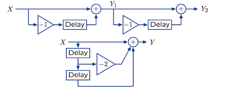

## Feedforward & Feedback

### 1. Feedforward

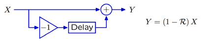

Subtract a right-shifted version of the input signal from a copy of the input signal.

### 2. Feedback

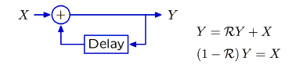

Systems with signals that depend on **previous values** of the same signal are said to have feedback.

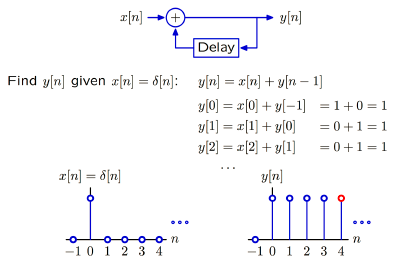

The feedback system change the unit sample into a **constant, persistent signal response**.

## Convert Between Feedback and Feedforward

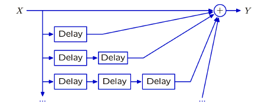

$Y = (\sum_{i \in \mathbb{N}} R^i)\cdot X \equiv \frac{X}{1-R}$

We can try to prove this by getting $(\sum_{i \in \mathbb{N}} R^i) \cdot (1-R) \equiv 1$.

## Cyclic Signal Path

-   **Acyclic**: all the paths through system flow from input to output with no cycles.
-   **Cyclic**: at least one cycle.

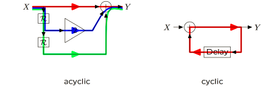

-   Feedback and Cyclic Paths are related, **response will persist even though the input is transient**.

-   The impulse response of an **acyclic system** has **finite duration**, while **cyclic system** has **infinite duration**.

## Fundamental Modes

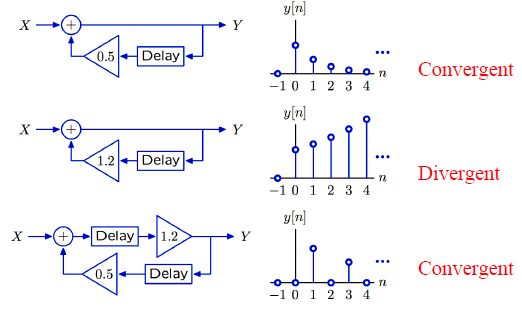

We can get **geometric sequence**: $y[n] = (0.5)^n$ or $y[n] = (1.2)^n$ ($\forall n \in \mathbb{N}$).

The **geometric sequences** are called **fundamental modes**.

# VE216 Lecture 3

## Poles

**Pole** is the base of the geometric sequence.

It can be used to characterize a **unit-sample/impulse** response system.

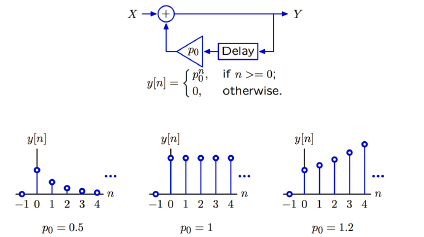

## Second-Order System

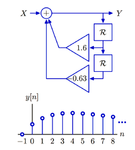

We can **break the system into two simpler systems**.

$\{Y = X + 1.6RY-0.63R^2Y\} \rightarrow \{(1-0.7R)(1-0.9R)Y = X\}$

Then we can change the block diagram into simpler form:

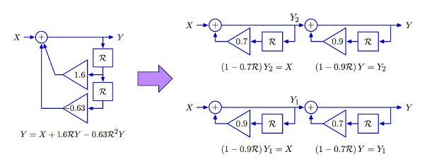

Thus we get $\frac{Y}{X} = \frac{1}{(1-0.7R) \times (1-0.9R)} = \frac{1}{1-0.7R}\times\frac{1}{1-0.9R} \equiv (\sum_{i\in\mathbb{N}}(0.7R)^i) \times (\sum_{i\in\mathbb{N}}(0.9R)^i)$.

Change the **Feedback** to **Feedforward**:

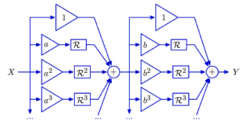

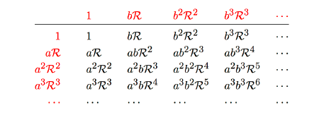

Then we can change $\frac{Y}{X} = \frac{1}{1-0.7R}\times\frac{1}{1-0.9R} = \frac{4.5}{1-0.9R} - \frac{3.5}{1-0.7R}$.

Thus the equivalent form is:

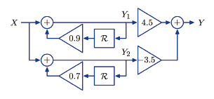

$y[n] = 4.5(0.9)^n-3.5(0.7)^n, n\in\mathbb{N}$

## Some tricks

Substitute $R = z^{-1}$ we can find the root easier: $\frac{Y}{X} = \frac{1}{(1-0.7R)(1-0.9R)} = \frac{z^2}{(z-0.7)(z-0.9)}$.

If the **denominator** is **second-ordered**, then **2** poles.

**Unit-sample Response** of **second-order system** can be written as **weighted sum of fundamental modes**.

## Complex Poles

$\frac{Y}{X} = \frac{1} {1-R+R^2} = \frac{z^2}{z^2-z+1}$, and the corresponding $z = \frac{1}{2}\pm \frac{\sqrt{3}}{2}j = e^{\pm\frac{\pi}{3}j}$.

$\frac{Y}{X} = \frac{1}{1-e^{\frac{\pi}{3}j}R}\times\frac{1}{1-e^{-\frac{\pi}{3}j}R}$, so the **fundamental modes**:

-   $e^{\frac{n\pi}{3}j} = cos(\frac{n\pi}{3}) + j\cdot sin(\frac{n\pi}{3})$
-   $e^{-\frac{n\pi}{3}j} = cos(\frac{n\pi}{3}) - j\cdot sin(\frac{n\pi}{3})$

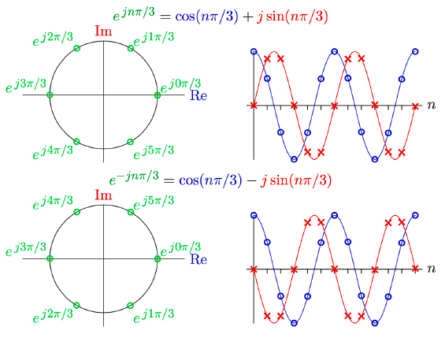

So $H = \frac{Y}{X} = \frac{1}{j\sqrt{3}} \cdot ( \frac{e^{\frac{\pi}{3}j}}{1-e^{\frac{\pi}{3}j}R} - \frac{e^{-\frac{\pi}{3}j}}{1-e^{-\frac{\pi}{3}j}R} )$.

So $h[n] = \frac{1}{j\sqrt{3}} \cdot (e^{\frac{(n+1)\pi}{3}j} - e ^ {-\frac{(n+1)\pi}{3}j}) = \frac{2}{\sqrt{3}} \cdot sin \frac{(n+1)\pi}{3}$.

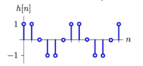

**The output of a "real" system has real values.**