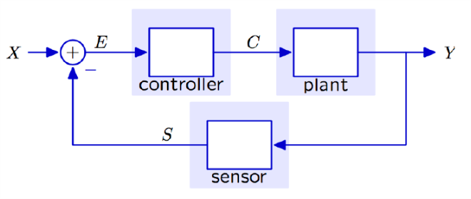
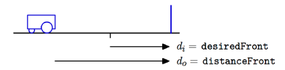
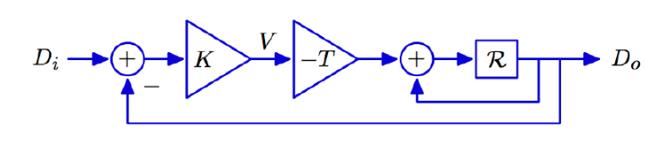
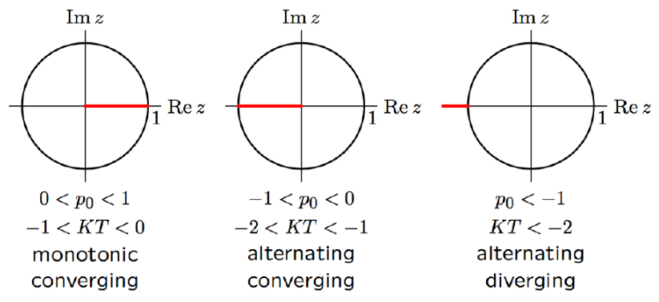
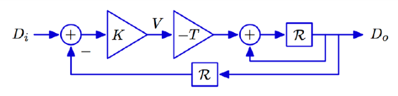
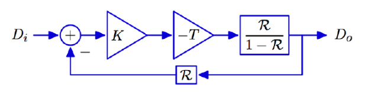
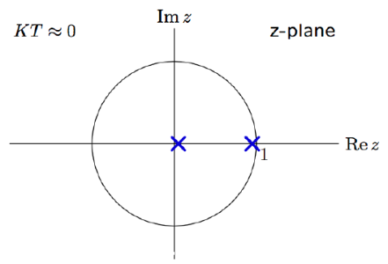
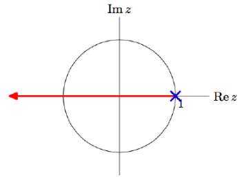
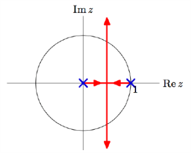
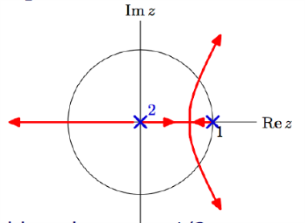

# VE216 Lecture 10

>   Feedback and Control

## Structure of a Control Problem

-   plant: the system to be controlled
-   sensor: measures the output of plant
-   controller: specify a command C to plant based on difference between X and S

## Analysis of Wall Finder System

Controller: $v[n] = K(d_i[n] - d_s[n])$

Sensor with no delay: $d_s[n] = d_o[n]$

Locomotion: $d_0[n] = d_o[n-1] - Tv[n-1]$

So we get $\frac {D_o} {D_i} = \frac{-KTR}{1-(1+KT)R}$

The single pole is $z=1+kT$

## Pole Analysis

$\frac {D_o} {D_i} = \frac{-KTR}{1-(1+KT)R} = \frac{(1-p_0) R}{1-p_0R}$ and $p_0 = 1+KT$ 

## Analysis of Wall Finder System: Adding Sensor Delay

Controller: $v[n] = K(d_i[n] - d_s[n])$

Sensor with no delay: $d_s[n] = d_o[n - 1]$

Locomotion: $d_0[n] = d_o[n-1] - Tv[n-1]$

Or we get

$\frac {D_o}{D_i} = \frac{-KTR}{1-R-KTR^2}$ with the poles $z = \frac 1 2 \pm \sqrt {(\frac 12)^2 + KT}$

## Poles Analysis

$z = 1 + KT, -KT$ when $KT$ is small: 

-   pole near 0 fast response
-   pole near 1 slow response
-   slow response, slow mode dominates the response.

When $KT$ become negative, $z = \frac 1 2$ with $KT = -\frac 1 4$

-   The system is stable.
-   Persistent responses (from pole > 1) decay.

When $KT < -\frac 1 4$, then the poles become complex.

-   Oscillation.
-   $KT = -1$ the period of oscillation is 6 since $p_0 = e^{\pm j\pi / 3}$.

## Destabilizing Effect of Delay

-   no delay: 

    $z = 0$ is the fastest response with 0 delay.

-   one delay: 

    $z=\frac 1 2$ is the fastest response with 1 delay.

-   more delay: 

    $z = 0.682$ is the fastest response with 2 delay. Even slower.

## Summary

-   Stability of feedback system is determined by dominant pole.
-   Delay tend to decrease the stability of the system.