# VE216 Lecture 11

>   CT Frequency Response and Bode Plots

## Asymptotic Magnitude Behavior

### Isolated Zero

| Magnitude                                | Asymptotic                               |
| ---------------------------------------- | ---------------------------------------- |
| 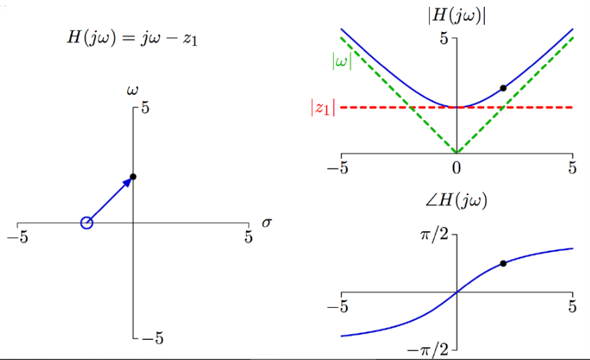 | 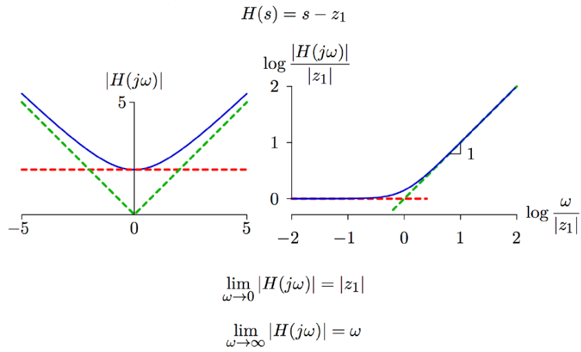 |

### Isolated Pole 

| Magnitude                                | Asymptotic                               |
| ---------------------------------------- | ---------------------------------------- |
| 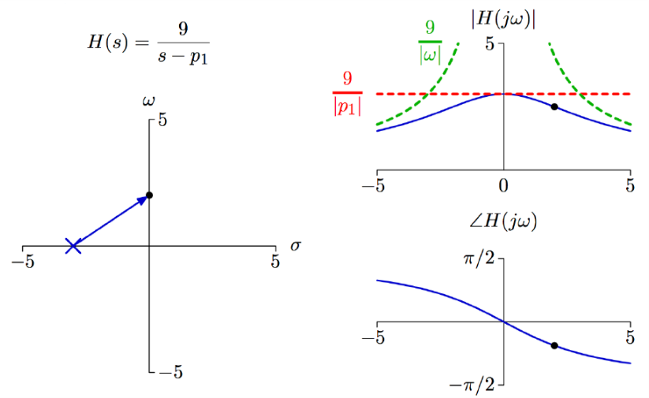 | 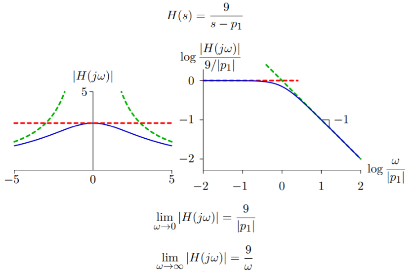 |

## Complicated Systems Asymptotic Behavior

$\begin{align} H(s_0) = K\frac {\prod^Q_{q=1} (s_0-z_q)}{\prod^P_{p=1} (s_0-p_p)} \end{align}$, then $\begin{align}|H(s_0)| = \Big|K\frac {\prod^Q_{q=1} (s_0-z_q)}{\prod^P_{p=1} (s_0-p_p)} \Big| = |K|\frac {\prod^Q_{q=1} |s_0-z_q|}{\prod^P_{p=1} |s_0-p_p|}  \end{align}$

Thus $log |H(j\omega)| = log|K| + \sum^Q_{q=1} log|j\omega - z_q| - \sum^P_{p=1}log|j\omega - p_p|$

With proportion to the $log (\omega)$, we get the bode plot.

## Bode Plot Angle

According to the previous lectures: $\begin{align}\angle H(s_0) = \angle(K \frac {\prod ^Q_{q=1}(s_0-z_q)} {\prod^P_{p=1}(s_0-p_p)}) \end{align} = \angle K + \sum^Q_{q=1} \angle(s_0-z_q) - \sum^P_{p=1}\angle(s_0-p_p)$

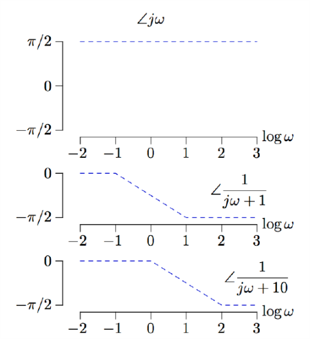

If we need more calculation, then we can add them together as a graph.

## Bode Plot: dB

$|H(j\omega)|\text{[dB]} = 20log_{10}|H(j\omega)|$

For $H(j\omega) = \frac 1 {j\omega + 1}$, the approximation is here

| $X$       | $20 log_{10}X$ |
| --------- | -------------- |
| $1$       | $0$ dB         |
| $\sqrt 2$ | $3$ dB         |
| $2$       | $6$ dB         |
| $10$      | $20$ dB        |
| $100$     | $40$ dB        |

## Frequency Response of High-Q System

$H(s) = \frac 1 {1 + \frac 1 Q \frac s {\omega_0} + (\frac s {\omega_0})^2}$

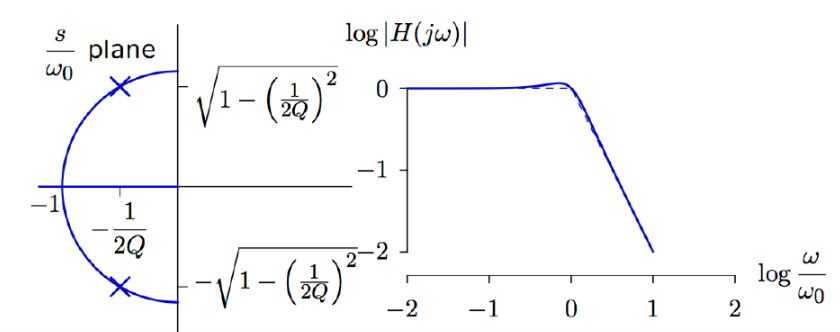

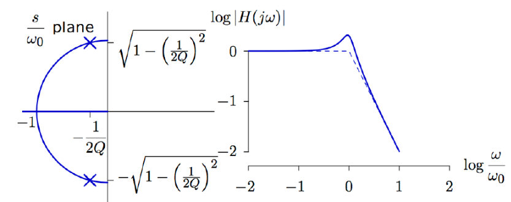

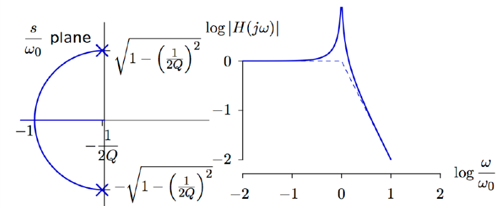

## Peak Magnitude Dependence

Assume $Q > 3$. Then we see on the $\frac s {\omega_0}$ plane:

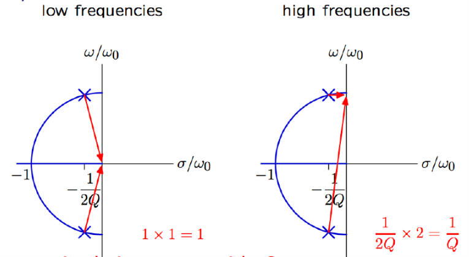

So the peak magnitude increase with $Q$.

##  3dB Bandwidth and Phase Change

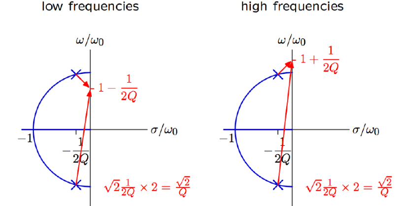

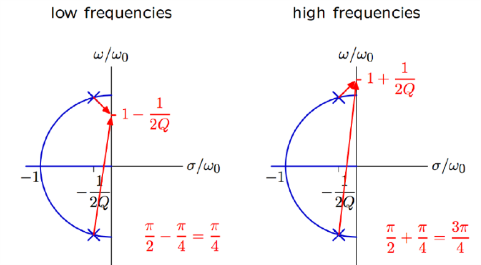

Change in phase approximately $\pi / 2$.

## Frequency Response of a High-Q System

As $Q$ increases, the phase changes more abruptly with $\omega$.

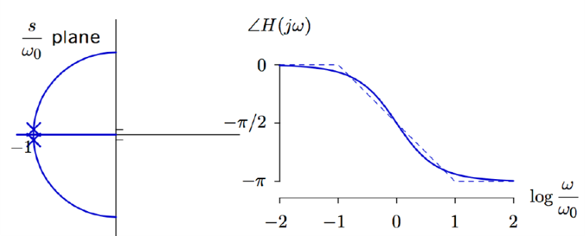

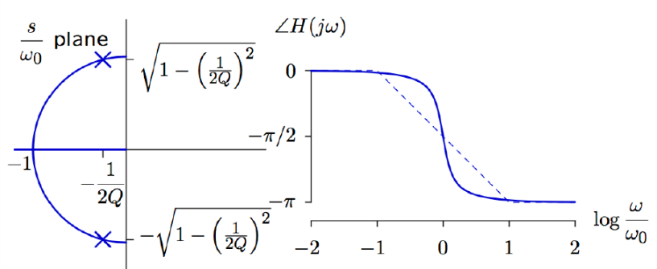

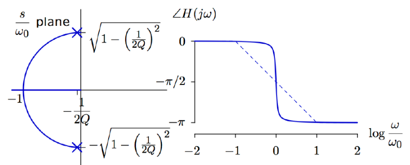

