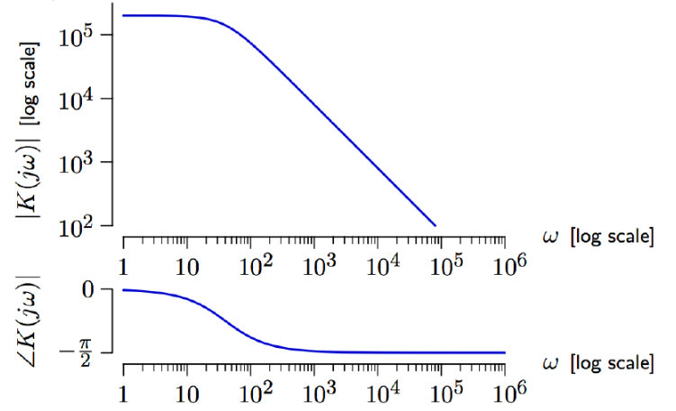
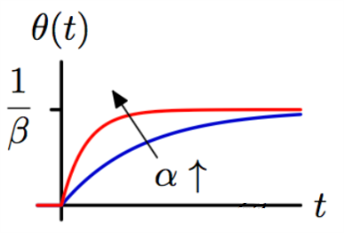

# VE216 Lecture 12

>   CT Feedback and Control

## Op-Amp Data Introduction

The gain of an op-amp depends on frequency.

The **low-gain** at **high frequencies** limits applications.

## Time Constant and System Function Control

In an increasing system, the time constant $\tau$ is the time for the step response to reach $1-\frac 1 e$ of the final value.

### System Bode Plot to Frequency Response

We can see the plot of the frequency response looks like the bode plot of $\frac{1}{s + \alpha}$.

Then we do some improvements to make it real: $K(s) = \frac {\alpha K_0}{s+\alpha}$.

With inverse Laplace transform, we get $h(t) = \alpha K_0 e^{-\alpha t}u(t)$ as impulse response.

Then integrate from $-\infty$ to $t$, we get $s(t) = \int^t_{-\infty}h(\tau)d\tau = \int ^t_0h(\tau)d\tau = K_0(1-e^{-\alpha t})u(t)$.

With the parameter $K_0 = 2\times 10 ^ 5$ and $\alpha = 40$, we get the result that $\tau = \frac 1 \alpha =\frac 1 {40}s$.

##  Op Amp Disadvantages

-   Frequency Response: the high gain is only in low frequencies.
-   Step Response: slow by electronic standards ($\tau = \frac 1 {40}s$).

## Performance Improvement by Feedback

So the origin pole is $s=-\alpha$.

The new pole is $s = -\alpha (1+ \beta K_0)$, even negative then 0.

So consider $\tau$ will be smaller, the response is faster.

## Detailed Performance Improvement

-   Feedback trades gain for band width (the width of frequency to maintain the gain unchanged):

-   Step response: $s(t) =\frac {K_0} {1+\beta K_0}(1-e^{-\alpha (1+\beta K_0)t})u(t)$

​	with the same $\frac d {dt} s(t) \Big|_{t= 0^+}$

## Motor Controller

We build a robot arm with input $v(t)$ and output as $\theta(t)$.

The **rotational speed** is proportional to the **input voltage**.

So the angle is the **integral** of rotation speed.

So we apply the proportional **feedback** to control the angle of the motor's shift.

the feedback function is $\begin{align}\frac \Theta V = \frac {\alpha \gamma A}{1+\alpha \beta \gamma A} = \frac {\alpha \gamma}{s+\alpha \beta \gamma}\end{align}$ (substitute $A$ with $\frac 1 s$) with single pole $-\alpha \beta \gamma$.

Then the impulse response: $h(t) = \alpha \gamma e^{-\alpha \beta \gamma t}u(t)$.

Then the step response: $s(t) = \frac 1 \beta (1 - e^{-\alpha \beta \gamma t})u(t)$.

In real life, the motor integrator has lag, so we change it:

with the step response:

So the second-order model is:

with feedback frequency response: $\begin{align} \frac {\frac{\alpha \gamma pA^2}{1+pA}}{1 + \frac{\alpha\beta \gamma pA^2}{1+pA}} = \frac{\alpha \beta pA^2}{1+pA+\alpha \beta \gamma pA^2} = \frac {\alpha \gamma p}{s^2 + ps +\alpha\beta\gamma p} \end{align}$

thus the poles are $\begin{align}s = -\frac p 2 \pm \sqrt{(\frac p 2)^2-\alpha \beta \gamma p}\end{align}$

When we increase the $\beta$, then we get the two poles collide from $0$ and $-p$ to imaginary part.

| poles                                    | diagrams                                 |
| ---------------------------------------- | ---------------------------------------- |
|  |  |

## Summary

CT feedback is useful to

-   Increase speed and bandwidth
-   Control position instead of speed