# VE216 Lecture 13

>   CT Feedback and Control

## Reducing sensitivity to unwanted parameter variation

Change the original form of

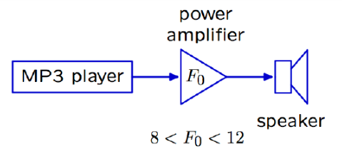

into the form of

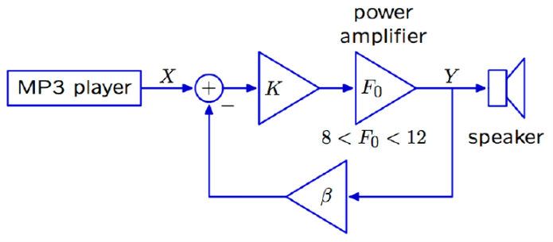

with the system function $H(s) = \frac {KF_0}{1+\beta K F_0}$ (if $K$ is large, then $H(s) \to \frac 1 \beta$).

### Example

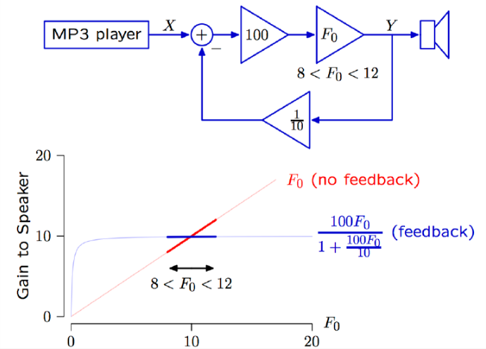

## Stabilize unstable Systems

### Magnetic Levitation Modeling

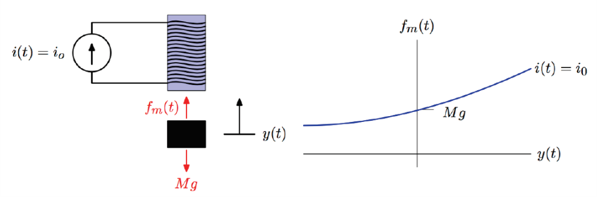

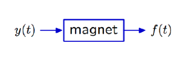

This kit is unstable:

-   increase $y(t) $ $\to$ increase force $\to$ further increase $y(t)$.
-   decrease is vise versa.

So we need a feedback system for the magnet block.

Then we list the force balance function (for small distance we can do linear approximation) and generate a block diagram:

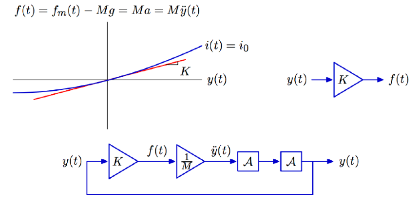

Since the $y(t)$ indicates location, transfer back into the magnet block, output the force $f(t)$ and through $\frac 1 M$ block to get the acceleration.

### Spring Levitation Modeling

With the balance function $F = K(x(t) - y(t)) = M\ddot{y}(t)$.

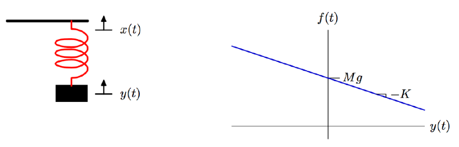

### Difference Between Block Diagrams

#### Spring and Mass

$F = K(x(t) - y(t))  = M\ddot{y}(t)$

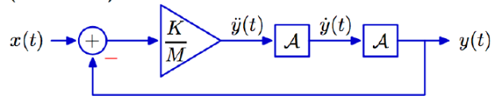

$\begin{align}\frac Y X=\frac {\frac K M }{s^2 + \frac KM} \to s = \pm j \sqrt {\frac K M } \end{align}$ 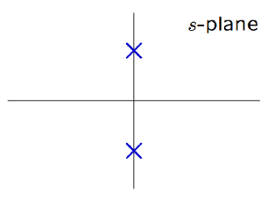

####  Magnetic Levitation

$F = Ky(t) = M\ddot{y}(t)$

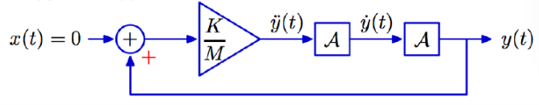

$\begin{align}K = Ms^2 \to s = \pm \sqrt{\frac K M} \end{align}$ 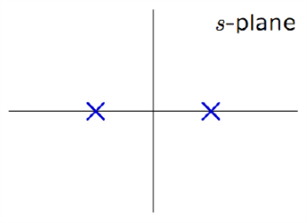

So this system is unfortunately unstable... A zero is positive.

Still need improvement.

### Remark on S-plane

If you forget something, notice that we first derive a $H(s)$ from frequency response require.

Then we get the $H(s)$ to get poles of forms $\sigma + j \omega$.

The imaginary part is causing the oscillating.

The real part is indicating the system's divergence of convergence, separate into DT and CT situation:

-   DT: $p^n$ is mainly in each part of $a[n]$.
-   CT: $e^{pt}$ is mainly in each part of $a(t)$.

So the convergence is depending on the signal categories, then we choose the $p$'s scope.

### Stabilizing Magnetic Levitation

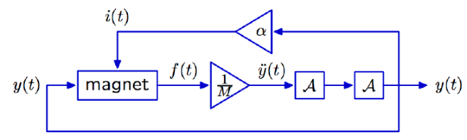

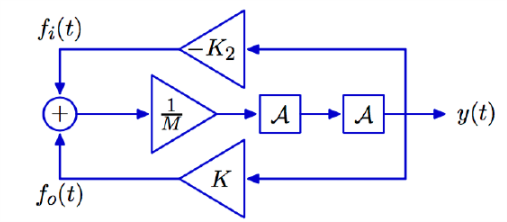

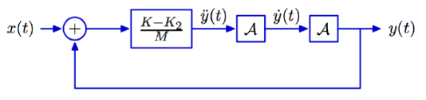

Thus we get the s-plane plot, increase $K_2$ moves the poles together, collide, on $j\omega$ axis.

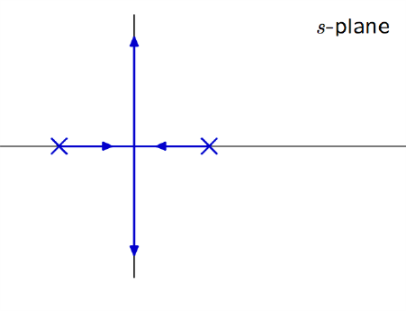

It is marginally stable (all the poles are 0-real part, so to say all imaginary part; the poles are all different).

So we need to do something more.

