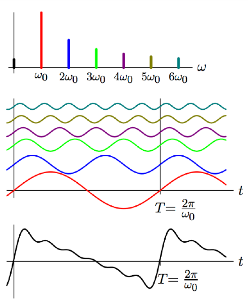

# VE216 Lecture 14

>   Fourier Representations

## Fourier Representation

-   Represent signals in terms of sinusoids.
-   New representation for **systems** as **filters**.

## Fourier Series

The harmonic components:

## Harmonic Representations

-   The sum of **harmonic components** can only be **periodic components**.
-   All harmonic of $\omega_0$ are periodic in $T = 2\pi / \omega_0$.
-   all the periodic signals with harmonics can be represented as Fourier representation.

## Harmonics Properties

-   Multiplying **two harmonics** produces a **new harmonics** with same **fundamental frequency**: $e^{j\omega_0kt} \times e^{j\omega_0lt} = e^{j\omega_0(l+k)t}$

-   The integral of a **harmonic** over **any time interval** with length equal to a period $T$ is **zero** unless the harmonic is at **DC**:

    $\begin{align}\int^{t_0+T}_{t_0} e^{jk\omega_0 t}dt = \int_Te^{jk\omega_0t}dt = \begin{cases}0, k\neq 0\\T, k=0 \end{cases} = T\delta[k] \end{align}$

## Separating Harmonic Components

$x(t) = x(t+ T) = \sum^{\infty}_{-\infty}a_ke^{j\omega_0kt}$

Then we see $\begin{align}\int_Tx(t) e^{-jl\omega_0t} = \int_T \sum^{\infty}_{k=-\infty}a_k e^{j\omega_0(k-l)t} = \sum^\infty_{k=-\infty}a_kT\delta[k-l] = Ta_l \end{align}$

So $\begin{align}a_k = \frac 1 T \int _Tx(t)e^{-j\omega_0kt}dt = \frac 1 T\int _Tx(t) e^{-j\frac {2\pi}Tkt}dt \end{align}$

## Fourier Series

-   analysis equation: $\begin{align}a_k = \frac 1 T \int _Tx(t)e^{-j\omega_0kt}dt = \frac 1 T\int _Tx(t) e^{-j\frac {2\pi}Tkt}dt \end{align}$
-   synthesis equation: $\begin{align}x(t) = x(t+ T) = \sum^{\infty}_{k=-\infty}a_ke^{j\omega_0kt} \end{align}$

## Example

$\begin{align}a_k &=\frac 1 T\int _Tx(t) e^{-j\frac {2\pi}Tkt}dt = -\frac 1 2\int ^0_{-\frac 1 2} e^{-j2\pi kt}dt + \frac 1 2 \int ^{\frac 1 2} _0 e^{-j2\pi kt}dt\\&=\frac 1 {j4\pi k}(2-e^{j\pi k} - e^{-j\pi k}) \\&=\begin{cases}\frac 1 {j\pi k}, mod(k,2) = 1\\0, otherwise \end{cases} \end{align} $

## Fourier Series Properties

If a signal is differentiated in time $t$, its Fourier coefficients are multiplied by $j\frac {2\pi} T k$.

## Example

Since the triangle wave is the integral of square wave, then each of triangle wave's Fourier coefficient is multiplied by $\frac T {j 2\pi k} = \frac 1 {j2 \pi k}$ here.

## Convergence of Fourier Series

Fourier series representations of functions with discontinuous slopes **converge toward** functions with discontinuous slopes.

## Remark: Gibb's Phenomenon

**Partial sums** of discontinuous functions' Fourier series **"ring" around discontinuities**.

The reason of "$9\%$" difference on triangle wave is: its Fourier coefficients only decreases at $\frac 1 k$.

So the triangle wave decreases at $\frac 1 {k^2}$.

Decrease or eliminating the ringing by **decreasing the magnitudes of Fourier coefficients at higher frequency**.