# VE216 Lecture 15

>   Fourier Series

## Fourier Series

-   analysis equation: $\begin{align}a_k = \frac 1 T \int _Tx(t)e^{-j\omega_0kt}dt = \frac 1 T\int _Tx(t) e^{-j\frac {2\pi}Tkt}dt \end{align}$
-   synthesis equation: $\begin{align}x(t) = x(t+ T) = \sum^{\infty}_{k=-\infty}a_ke^{j\omega_0kt} \end{align}$

## Orthogonal Decompositions

>   Integrate over period $T$, then we **sift** out the $k^{th}$ Fourier series component.

The sifting is a inner product:

$\begin{align}a_k = e^{j\frac {2\pi}T kt} \cdot x(t) = \frac 1 T \int _T x(t) e^{-j\frac {2\pi}T kt}dt \end{align}$, or so to say $\begin{align}a(t) \cdot b(t) = \frac 1 T \int _T a^*(t) b(t) dt \end{align}$.

Then we see the inner product of $k^{th}$ and $m^{th}$ equal to 1 iff $k = m$.

## Filtering

It is trivial that we get the following input and output of a LTI system:

$\begin{align}x(t) = \sum^\infty_{k=-\infty} a_k e^{j\frac {2\pi}T kt} \to y(t) = \sum^{\infty}_{k=-\infty}a_kH(j\frac{2\pi}Tk)e^{j\frac {2\pi} T kt} \end{align}$

## Low-Pass Filtering

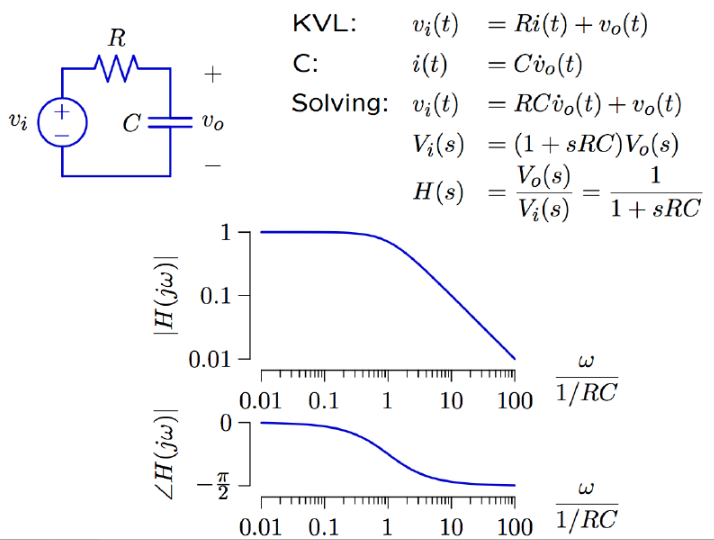

Then we can see if the $\omega = k\omega_0$ under different frequency.

| 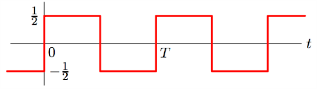 | 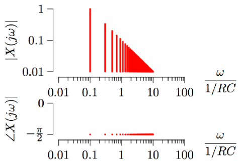 |
| ---------------------------------------- | ---------------------------------------- |
| 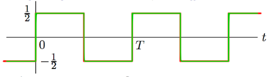 | 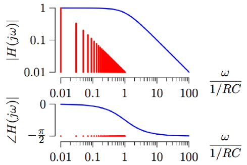 |
| 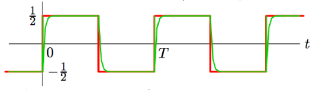 | 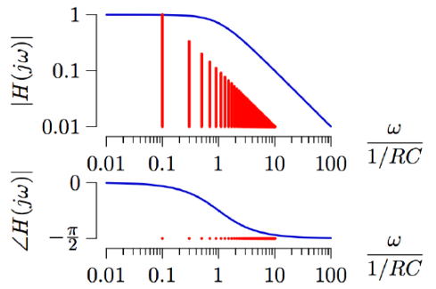 |
| 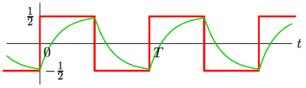 | 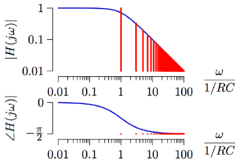 |
| 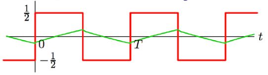 | 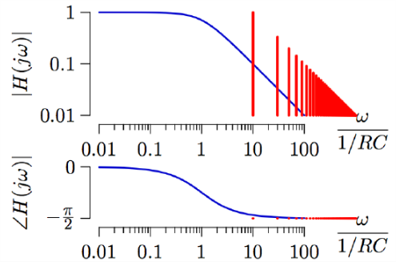 |

