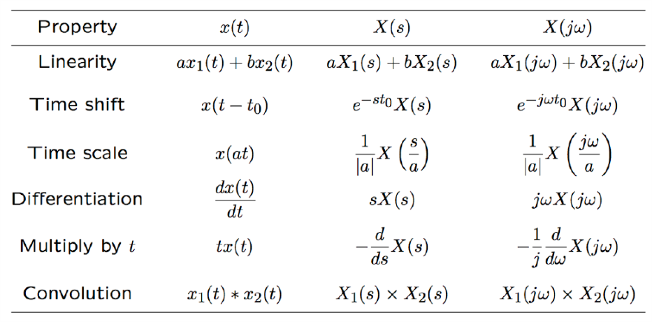
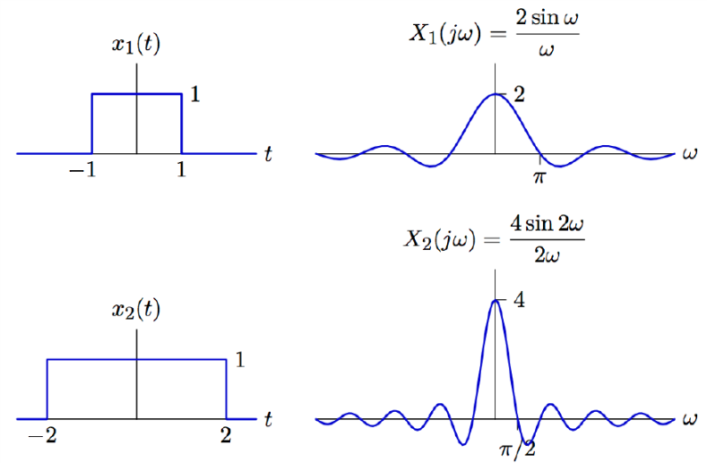
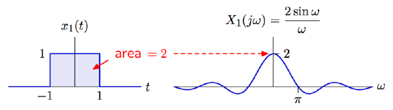
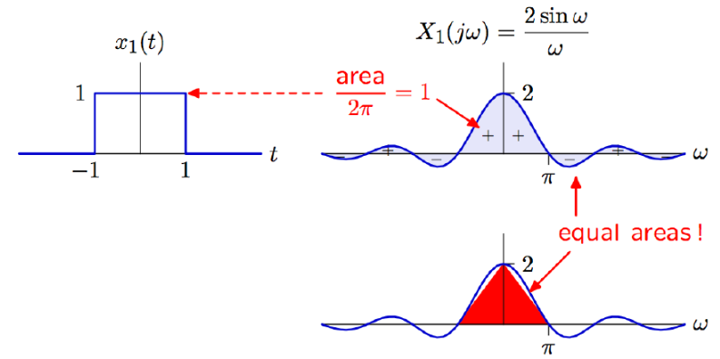
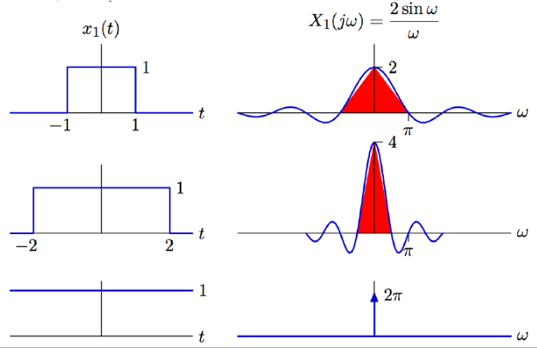
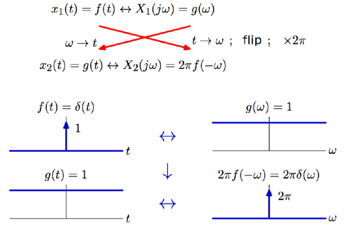
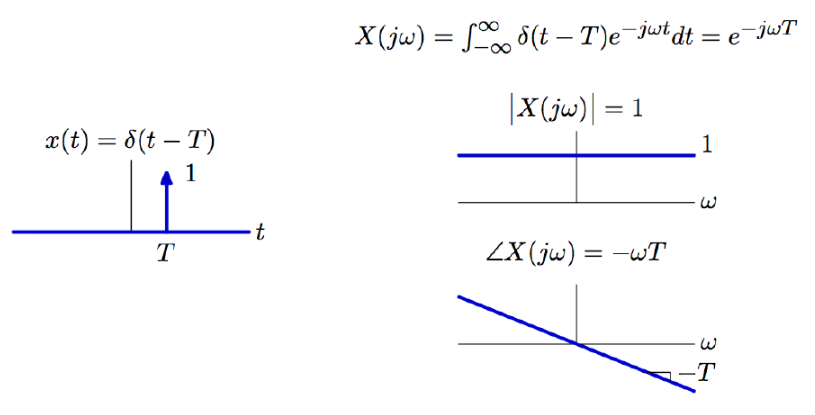
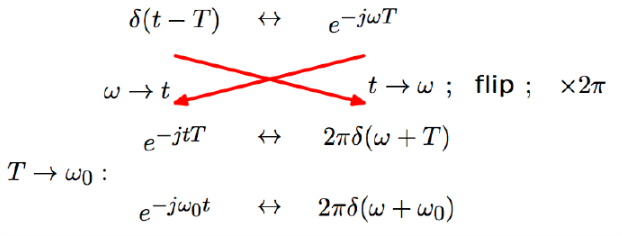
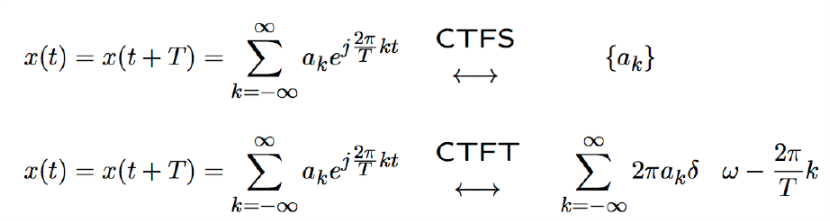

# VE216 Lecture 16

>   Fourier Transform

## Fourier Series

-   Analysis equation: $\begin{align}X(j\omega) = \int ^\infty_{-\infty} x(t) e^{-j\omega t}dt \end{align}$
-   Synthesis equation: $\begin{align} x(t) = \frac 1 {2\pi} \int ^{\infty}_{-\infty} X(j\omega) e^{j\omega t} d\omega \end{align}$

$E(\omega) = X(j\omega)$

## Relation between Fourier and Laplace Transforms

## Fourier Transform Property

$\begin{align}x_1(at) \leftrightarrow \frac 1 {|a|} X_1(\frac {j\omega}a) \end{align}$

## Moments

Since $\begin{align}X(j\omega) = \int ^\infty_{-\infty} x(t) e^{-j\omega t}dt\end{align}$, then $\begin{align}X(0) = \int ^\infty_{-\infty} x(t) dt \end{align}$, and here we get $2$ as result.

Then $\begin{align} x(t) = \frac 1 {2\pi} \int ^{\infty}_{-\infty} X(j\omega) e^{j\omega t} d\omega \end{align}$, so $\begin{align} x(0) = \frac 1 {2\pi} \int ^{\infty}_{-\infty} X(j\omega)  d\omega = 1 \end{align}$, or $\begin{align} \int ^{\infty}_{-\infty} X(j\omega)  d\omega = 2\pi \end{align}$.

## Duality

## Other Impulses

$\delta(t- T)  \leftrightarrow e^{-j\omega T}: $ 

## Relation between Fourier Transform and Fourier Series

