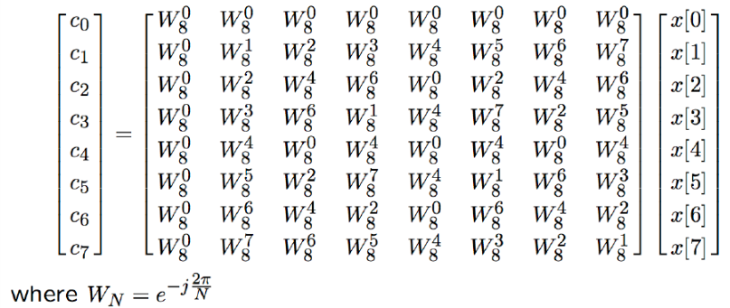
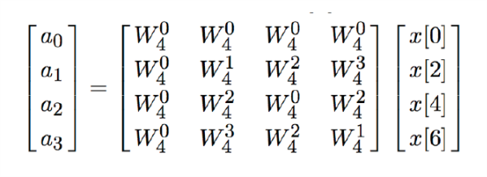
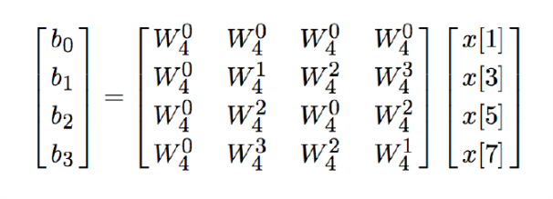
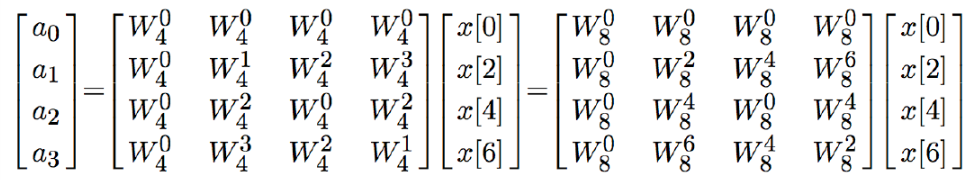
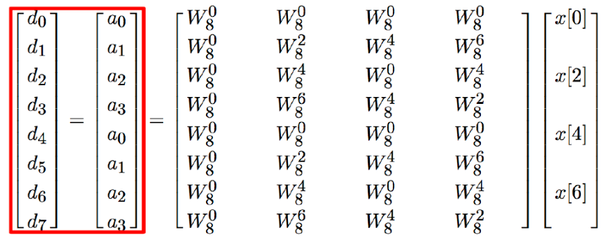
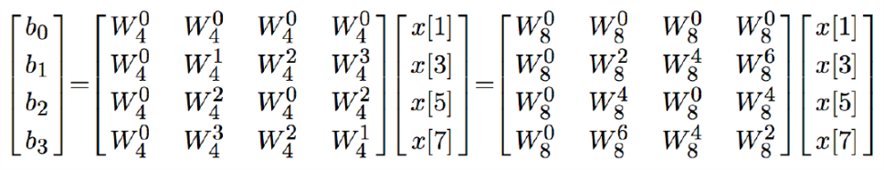
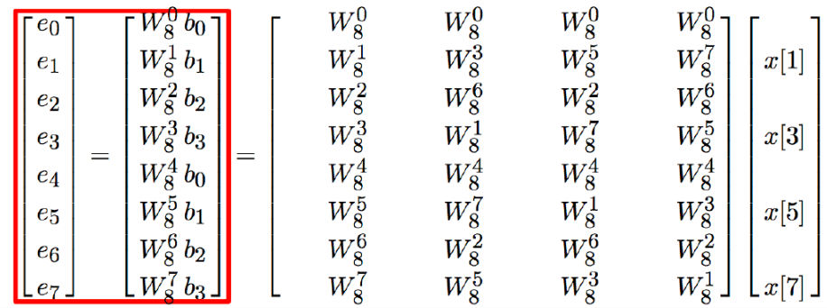
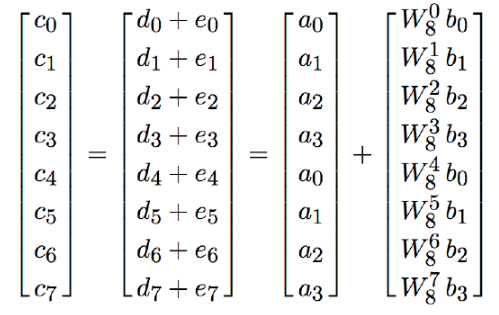

# VE216 Lecture 18

>   DT Fourier Representations

## FFT

This is actually 64 multiplications.

So we can generate the FFT calculation method.

### FFT - Even numbered and Odd numbered Part

| Even numbered                            | Odd Numbered                             |
| ---------------------------------------- | ---------------------------------------- |
|  |  |

Total 32 multiplications.

## Fourier Transform: Aperiodic Signals

$x[n] \to$ aperiodic DT signal.

Then we have the periodic extension: $\begin{align}x_N[n] = \sum^ \infty_{k=-\infty}x[n+kN]\end{align}$

So $x[n] = \lim_{N\to\infty} x_N[n]$

