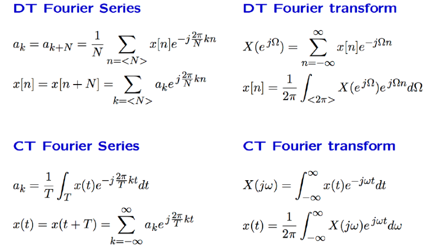
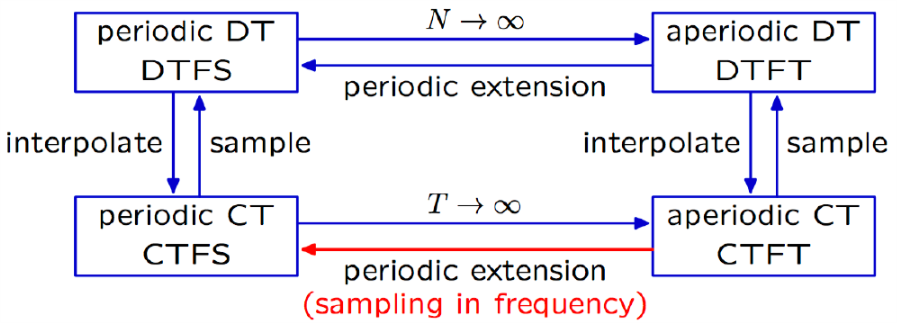

# VE216 Lecture 19

>   Fourier Representations Relations

## Relation between Fourier Transform and Series

$\begin{align}X(j\omega) =\sum^\infty_{k=-\infty} 2\pi a_k\delta(\omega - k\omega_0) \end{align}$

## Relation among Fourier Representations

## Relation between CT and DT Transforms

$x_p(t) = x(t)p(t)$ where $\begin{align} p(t) = \sum^\infty_{k=-\infty}\delta(t+kT) \end{align}$

$\begin{align}X(e^{j\Omega}) = \sum_n x[n] e^{-j\Omega n} \end{align}$ and $\begin{align}X_p(j\omega) = \int x_p(t)e^{-j\omega t}dt = \sum_n x[n]e^{-j\omega nT} \end{align}$

$\Omega = \omega T$

