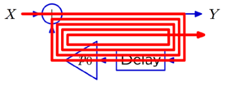

# VE216 Lecture 4

>   Continuous-time system

## Multiple Representations of CT Systems

>   the same as DT Systems

## Differential Equations

New methods based on **block diagrams** and **operators**, provide new ways to think about system's behaviors.

## Block Diagrams

>   Key difference is the **delays in DT** are replaced by **integrators in CT**.

-   **DT**: 

    **adders, scalers, delays**

-   **CT**: 

    **adders, scalers, integrators**

## Operator Representation

-   use the $A$ operator.
-   $A$ in CT signal generates a new signal that equals to **the integral of the input signal at all points**.
-   $Y=AX$ is equal to $y(t) = \int^t_{-\infty}x(\tau)d\tau$ for all the time $t$.

## Unit Impulse Signal

### Properties

-   Nonzero only at $t=0$.
-   Integral $(-\infty, +\infty)$ is $1$.

Represented by an arrow with number $1$, representing the **area** or **weight**.

## Unit Impulse and Unit Step

### Unit Step Definition

**Indefinite integral** of **unit impulse** is **unit step**.

$$u(t) = \int^t_{-\infty}\delta(\lambda)d\lambda = \begin{cases}1&t\ge0\\0&\text{otherwise} \end{cases}$$

Then we can see the block diagram: 

## Impulse Response of Acyclic CT System

If the block diagram of CT system has no feedback (acyclic, no circle), then the corresponding expression is **imperative**.

$Y=(1+A)^2X$

if $x(t) = \delta(t)$, then $y(y) = \delta(t) + 2u(t) + t\cdot u(t)$

## CT Feedback Methods

### Method 1: Differential Equation Method

$\dot{y}(t) = x(t) + py(t)$ this is a linear, first order equation with constant coefficients.

try $y(t) = C e^{\alpha t}u(t)$, then we get:

$\dot y(t) = \alpha C e^{\alpha t} u(t) + C e^{\alpha t} \delta (t) =  \alpha C e^{\alpha t} u(t)  + C\delta(t) = \delta(t) + pC e^{\alpha t} u(t) = x(t) + py(t)$

if $y(t) = e^{pt}u(t)$, the equation is satisfied ($\delta(t) = e^{pt}\delta(t)$).

### Method 2: Operator Method

$Y=A(X+pY) \leftrightarrow \frac{Y}{X} = \frac{A}{1-pA} = A(1 + pA + p^2A^2 + \cdots)$

Let $X = x(t) = \delta(t)$ then:

$y(t) = A(1+pA + p^2A^2 + \dots)\delta(t) \\=(1+pA+p^2A^2 + \dots)u(t) \\= (1 + pt + \frac{1}{2}p^2t^2 + \frac{1}{6}p^3t^3+\cdots)u(t) = e^{pt}u(t)$.

## Convergent and Divergent Poles

check the **CT system**: 

then we get a $y(t) = e^{pt}u(t)$.

We decide the convergence by this method:

if $Re(p) < 0$ then it is convergent, $Re(p) > 0$ then it is divergent.

## Feedback Comparison (CT, DT)

### CT Feedback

In CT, each cycle adds new integration. 

$y(t) = A(1+pA + p^2A^2 + \dots)\delta(t) \\=(1+pA+p^2A^2 + \dots)u(t) \\= (1 + pt + \frac{1}{2}p^2t^2 + \frac{1}{6}p^3t^3+\cdots)u(t) = e^{pt}u(t)$  

### PT Feedback

In DT, each cycle creates another sample in output: 

$y[n] = (1+pR+p^2R^2+p^3R^3 +\cdots)\delta[n]\\=\delta[n] + p\delta[n-1] + p^2\delta[n-2]+p^3\delta[n-3] + \cdots$ 

### Diagram Comparison

| Equation:      | $\dot{y}(t) = x(t)+py(t)$                | $y[n] = x[n]+py[n-1]$                    |
| :------------- | ---------------------------------------- | ---------------------------------------- |
| Block diagram: |  |  |
| Operator:      | $\frac A {1-pA}$                         | $\frac 1 {1-pR}$                         |
| Solution       | $e^{pt}u(t)$                             | $p^nu[n]$                                |
| Convergence:   |  |  |

## Convergent? (Exercise)

-   $\frac{1}{1-\frac{1}{4}R^2}$

    $Y = \frac{1}{1-\frac{1}{4}R^2}X\\ = k_1\frac{1}{1-\frac{1}{2}R}X+k_2\frac{1}{1+\frac{1}{2}R}X \\= k_1 (1 + \frac{1}{2}R + \frac{1}{4}R^2 + \cdots)X + k_2(1 + (-\frac{1}{2}R) + (-\frac{1}{2}R)^2 + \cdots)X$

    Poles of $\pm \frac{1}{2}$ for discrete case, so convergent.

-   $\frac{1}{1-\frac{1}{4}A^2}$

    $Y = \frac{1}{1-\frac{1}{4}A^2}X\\=k_1\frac{1}{1-\frac{1}{2}A}X + k_2\frac{1}{1+\frac{1}{2}A}X\\=k_1(1+\frac{1}{2}A + (\frac{1}{2}A)^2 + \cdots)X + k_2(1+(-\frac{1}{2}A) + (-\frac{1}{2}A)^2 + \cdots)X\\ = k_1 e^{1/2t} + k_2 e^{-1/2t}$

    Poles of $\pm \frac{1}{2}$ in continuous case, so divergent ($\frac{1}{2}$).

-   $\frac{1}{1+2R+\frac{3}{4}R^2}$

    $Y = \frac{1}{1+2R+\frac{3}{4}R^2}X\\=k_1\frac{1}{1+\frac{1}{2}R}X+k_2\frac{1}{1+\frac{3}{2}R}X$

    We have pole for $-\frac{3}{2}$ and $-\frac{1}{2}$ in discrete case, so divergent ($-\frac{3}{2}$).

-   $\frac{1}{1+2A+\frac{3}{4}A^2}$

    $Y = \frac{1}{1+2A+\frac{3}{4}A^2}X\\=k_1\frac{1}{1+\frac{1}{2}A}X+k_2\frac{1}{1+\frac{3}{2}A}X$

    The poles are $-\frac{1}{2}$ and $-\frac{3}{2}$ in continuous case, so convergent.

## Mass-Spring System (Exercise)

$F = K(x(t) - y(t)) = M \dot{\dot{y}}(t)$

$\frac{Y}{X} = \frac{\frac{K}{M}A^2}{1+\frac{K}{M}A^2}$, thus $p = \pm j\sqrt{\frac{K}{M}}$.

$e^{j\omega_0t} = cos\omega_0t+jsin\omega_0t$ and $e^{-j\omega_0t} = cos\omega_0t-jsin\omega_0t$.

$\frac{Y}{X} = \frac{\omega_0}{2j} (\frac{A}{1-j\omega_0A}) - \frac{\omega_0}{2j}(\frac{A}{1+j\omega_0A})$, with $\frac{A}{1\pm j\omega_0A}$ as two modes (check lecture 2 for **fundamental modes**)

Then check lecture 3 for **fundamental mode** and **complex poles**, we get:

$y(t) = \frac{\omega_0}{2j}(e^{j\omega_0t} - e^{-j\omega_0t}) = \omega_0 sin\omega_0t$, $t > 0$.

### An alternative (ugly) approach

$\frac{Y}{X} = \frac{\omega_0^2A^2}{1+\omega_0^2A^2} = \omega_0^2A^2\sum^\infty_{l=0}(-\omega_0^2A^2)^l$

then if $x(t) = \delta(t)$:

$y(t) = \sum^\infty_{l=0}\omega_0^2(-\omega_0^2)^lA^{2l+2}\delta(t) = \omega_0^2t-\omega_0^4\frac{t^3}{3!} + \omega_0^6\frac{t^5}{5!} \cdots = \omega_0sin\omega_0t$