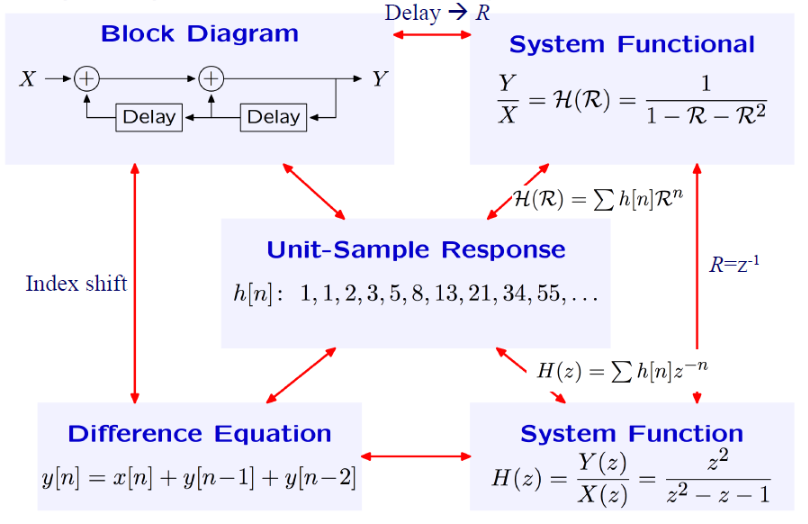
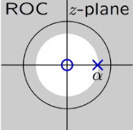
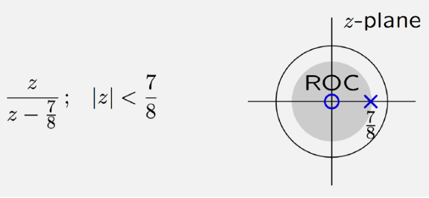
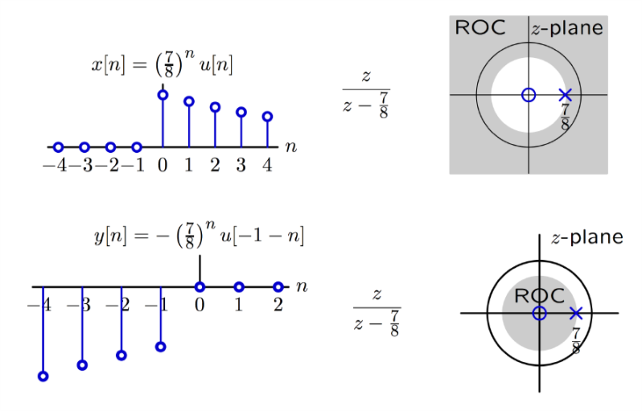
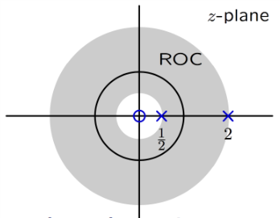
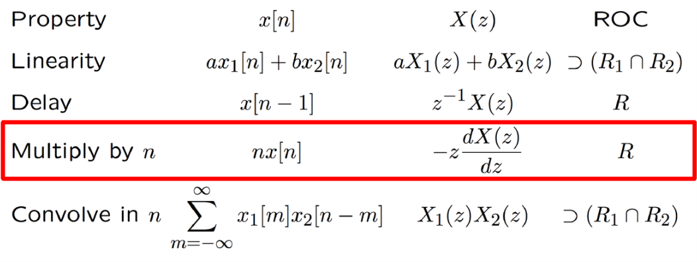

# VE216 Lecture 5

>   Z Transform

## Concept Map

## System Function in terms of Unit-sample Response

$\frac Y X=H(R) = h[0] + h[1]R+h[2]R^2+ \cdots = \sum_nh[n]R^n$

## Z Transform

$H(z) = \sum h[n]z^{-n} \to X(z) = \sum^\infty_{-\infty}x[n]z^{-n}$

## Z Transform Pairs

example: $x[n] = (\frac 7 8)^nu[n] \leftrightarrow X(z) = \frac{1}{1-\frac{7}{8}z^{-1}}$ with $\Big|\frac{7}{8}z^{-1}\Big| < 1$, i.e., $|z|>\frac{7}{8}$.

## Region of Convergence (ROC)

For the example above, the `ROC` is $|z| > \frac 78$

## Z Transform Properties

### Linearity Property

#### Predicate

-   $x_1[n] \leftrightarrow X_1(z)$ for $z$ in $ROC_1$
-   $x_2[n] \leftrightarrow X_2(z)$ for $z$ in $ROC_2$

#### Conclusion

-   $x_1[n] + x_2[n] \leftrightarrow X_1(z) + X_2(z)$ for $z$ in $(ROC_1 \cap ROC_2)$

### Delay Property

#### Predicate

$x[n] \leftrightarrow X(z)$ for $z$ in $ROC$

#### Conclusion

$x[n-1] \leftrightarrow z^{-1}X(z)$ for $z$ in $ROC$

#### Generality

-   $\delta[n] \leftrightarrow 1$

-   $\delta[n-1] \leftrightarrow z^{-1}$

-   $X(z) = \sum^\infty_{-\infty} x[n]z^{-n}$

    Let $y[n] = x[n-1]$, then $Y(z) = \sum^\infty_{-\infty}x[n-1]z^{-n}$

    So $z^{-1}X(z) = Y(z)$

## Rational Polynomials

A system can be described in **linear difference equation** with **constant coefficients** can also be described by a **Z transform** that is a **ratio of polynomials in $z$**.

$\sum_{i=0}^kb_iy[n-i] = \sum_{i=0}^ka_ix[n-i]$

$\sum^k_{i=0}b_i z^{-i}Y(z) = \sum^k_{i=0}a_i z^{-i} X(z)$

$H(z) = \frac{Y(z)}{X(z)} = \frac{\sum^k_{i=0}a_iz^{-i}}{\sum^k_{i=0}b_iz^{-i}}$

$(x[n-p] = X(z)z^{-p})$

## Poles and Holes

$H(z) = \frac{Y(z)}{X(z)} = \frac{\sum^k_{i=0}a_iz^{-i}}{\sum^k_{i=0}b_iz^{-i}} = \frac{\sum^k_{i=0}a_iz^{k-i}}{\sum^k_{i=0}b_iz^{k-i}} = \frac{\Pi_{i=0}^k(z-z_i)}{\Pi_{i=0}^k(z-p_i)}$

So the roots for numerator are **holes**.

The roots for denominator are **poles**.

## Region of Convergence (ROC)

Regions of convergence for Z transform are delimited by circles in Z-plane.

**Edges of circles are at the poles.**

### Example

$x[n] = \alpha^nu[n]$, so $X(z) = \sum^\infty_{k=0}\alpha^kz^{-k} = \frac{1}{1-\alpha z^{-1}}$.

We need $|\alpha z^{-1}| < 1$, so $|z| > |\alpha|$. So ROC is in outer region.

### Question: DT signal with ROC in Inner Region?

We get the same difference equation for the system: $y[n+1] - \frac 7 8y[n] = x[n+1]$

So corresponding to $y[n] = \alpha^n u[n]$ with $\alpha = \frac 78$ here and ROC outer region, the ROC inner region shows the **result** $y[n] = -\alpha^nu[-(n+1)]$.

## ROC Comparison

## Example Exercise

$X(z) = \frac{-3z}{2z^2-5z+2}$ inverse transform, ROC has the unit circle on z-plane.

$X(z) = \frac{z}{z-\frac{1}{2}} - \frac{z}{z-2}$.

So $\frac12$ pole is outer region and $2$ pole is inner region.

So $x[n] = (\frac{1}{2})^nu[n] - (-2^nu[-n-1]) = (\frac{1}{2})^nu[n] + 2^nu[-n-1]$

## Z Transform Properties

### Example

$Y(z) = (\frac{z}{z-1})^2$ inverse transform with $|z| > 1$ (assume $x[n] = \delta[n]$)

$Y(z) = (\frac z{z-1})^2$, so $\frac YX = (\frac 1 {1-R})^2 = (1 + R + R^2 + \cdots)^2 = \sum^\infty_{n=0}(n+1)R^n = (n+1)u[n]$

$h[n] = \frac{Y}{X} = (n+1)u[n] = y[n]$

### Another approach

$\begin{aligned}\frac{z}{z-1} &\leftrightarrow u[n]\\-z \frac d {dz}(\frac{z}{z-1}) = z(\frac 1 {z-1})^2 &\leftrightarrow nu[n]\\z\times(-z \frac d {dz}(\frac{z}{z-1})) = (\frac {z^2} {z-1})^2 &\leftrightarrow (n+1)u[n]\end{aligned}$

