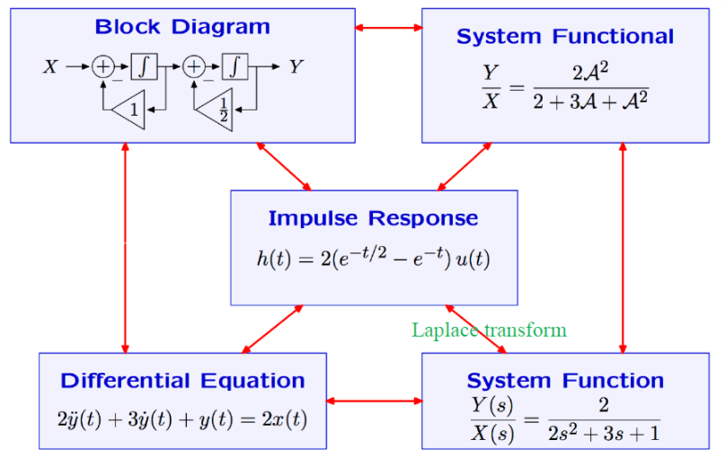
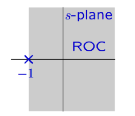
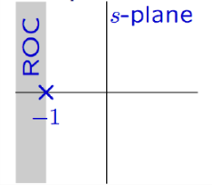
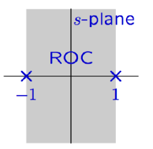
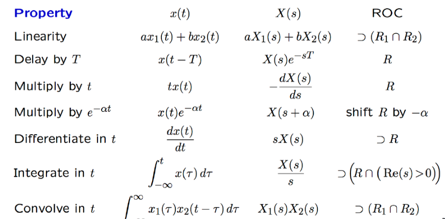

# VE216 Lecture 6

>   Laplace Transform

## Concept Map

## Laplace Transform Definition

$X(s) = \int x(t)e^{-st}dt$

### Two versions

-   Unilateral: $X(s) = \int^\infty_0 x(t)e^{-st}dt$
-   Bilateral: $X(s) = \int_{-\infty}^\infty x(t)e^{-st}dt$

(We focus on bilateral version.)

## Region of Convergence (ROC)

This is based on the $X(s) = \int_{-\infty}^\infty x(t)e^{-st}dt$, we can see from the examples.

## Example

### Exercise 1

$x_1(t) = \begin{cases} e^{-t} &t \geq 0\\0 &t< 0 \end{cases}$ Laplace transform.

$X_1(s) = L[x_1(t)] = \int_0^\infty e^{-t}e^{-st}dt = -\frac{1}{1+s}\int^\infty_0 -(1+s)e^{-(1+s)t}dt = -\frac{1}{1+s} e^{-(1+s)t}\Big|^\infty_0 = -\frac{1}{1+s}$

Since $e^{-(1+s)t}$ is convergent when $1+s < 0$, or $Re(s) > -1$, so ROC shows

### Exercise 2

$x_2(t) = \begin{cases}-e^{-t} &t\leq 0\\0 &t>0 \end{cases}$ Laplace transform.

$X_2(s) = \int_{-\infty}^0-e^{-t} e^{-st}dt = \frac{1}{1+s}\int^0_{-\infty}-(1+s)e^{-(1+s)t}dt = \frac{1}{1+s}$

Since $e^{-(1+s)t}$ is convergent for $x\in (-\infty,0)$, so $-(1+s) > 0$ or $Re(s) < -1$ with ROC shows

### Exercise 3

$x_3(t) = e^{-|t|}$ Laplace transform.

$X_3(s) = \int_{-\infty}^\infty e^{-|t|-st}dt = \int_0^\infty e^{-(1+s)t}dt + \int_{-\infty}^0 e^{(1-s)t}dt = \frac{e^{(1-s)t}}{1-s}\Big|^0_{-\infty}-\frac{e^{-(1+s)t}}{1+s}\Big|^\infty_0 = \frac{1}{1-s}+\frac{1}{1+s}$

So $1-s > 0$ and $1+s > 0$, $1 > s > -1$, with ROC shows

### Exercise 4

$\frac{2s}{s^2-4}$ Laplace inverse transform, how many possible solution and ROCs?

$\frac{2s}{s^2-4} = \frac{1}{s+2} + \frac{1}{s-2}$, with $\pm 2$ as poles.

-   $\frac{1}{s+2}$ has 2 forms with 2 ROCs.
    -   $\frac{1}{s+2} = \int^\infty_{-\infty}e^{-st}e^{-2t}u(t)dt = \int^\infty_0e^{-(2+s)t}dt = -\frac{1}{s+2}e^{-(2+s)t}\Big|^\infty_0$, so $2+s > 0$ with $Re(s) > -2$.
    -   $\frac{1}{s+2} = \int^\infty_{-\infty} -e^{-st}e^{-2t}u(-t)dt = \int^0_{-\infty}-e^{-(s+2)t} = \frac{1}{s+2}e^{-(s+2)t}\Big|^0_{-\infty}$, so $2+s < 0$ with $Re(s) < -2$.
-   $\frac{1}{s-2}$ has 2 forms with 2 ROCs
    -   $\frac{1}{s-2} = \int^\infty_{-\infty}e^{-st}e^{2t}u(t)dt = \int^\infty_0e^{(2-s)t}dt = \frac{1}{2-s}e^{(2-s)t}\Big|^\infty_0$, so $2-s < 0$ with $Re(s) > 2$.
    -   $\frac{1}{s-2} = \int^\infty_{-\infty} -e^{-st}e^{2t}u(-t)dt = \int^0_{-\infty}-e^{(2-s)t}dt = \frac{1}{s-2}e^{(2-s)t}\Big|^0_{-\infty}$, so $2-s > 0$  with $Re(s) < 2$.

So there are totally 3 solutions:

-   $x(t) = e^{-2t}u(t) + e^{2t}u(t)$ with $Re(s) > 2$
-   $x(t) = -e^{-2t}u(-t)-e^{2t}u(-t)$ with $Re(s) < -2$
-   $x(t) = e^{-2t}u(-t)-e^{2t}u(-t)$ with $2 > Re(s) > -2$

## Laplace Transform of a Derivative

$X_d(s) = \int^\infty_{-\infty}x'(t)e^{-st}dt = x(t)e^{-st}\Big|^\infty_{-\infty}-\int^\infty_{-\infty}x(t)(-s)e^{-st}dt$

Since $X(s)$ is convergent, so $x(t)e^{-st}\Big|^\infty_{-\infty}=0$, thus $X_d(s) = sX(s)$.

## Laplace Transform Properties

