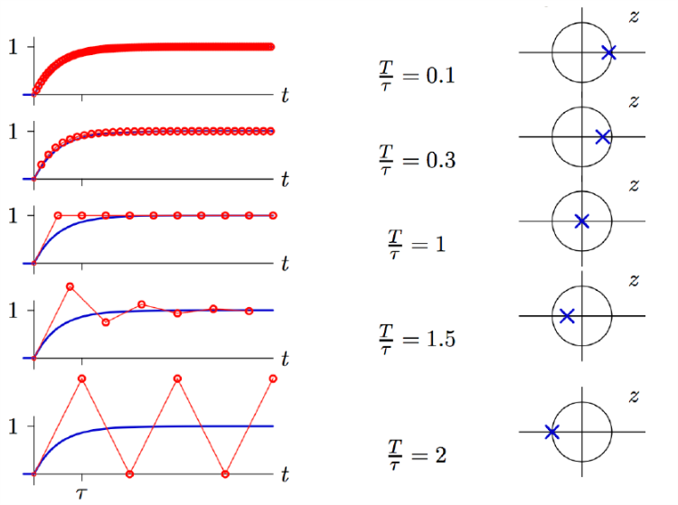
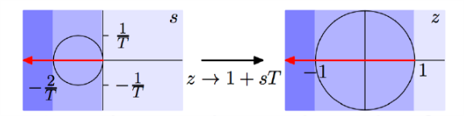
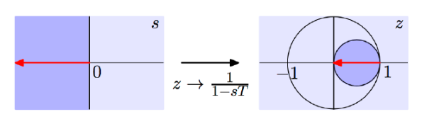

# VE216 Lecture 7

>   Discrete Approximation of Continuous Time Systems

## Concept Map

## Discrete Approximation of CT Systems

The step response (given $u(t)$ as the input) of the system:

$\begin{align}\delta(t) \to &\frac{A}{A+\tau} \to h(t) = \frac{1}{\tau}e^{-\frac{t}{\tau}}u(t)\\u(t)\to &\frac{A}{A+ \tau} \to s(t) = ?\\\delta(t) \to A \to u(t) \to &\frac{A}{A+\tau} \to s(t) = ?\\\delta(t) \to \frac{A}{A+ \tau} \to h(t) \to &A \to s(t) = \int^t_{-\infty}h(t')dt'  \end{align}$

$\begin{aligned} s(t) = \int^t_{-\infty} \frac{1}{\tau} e^{-\frac{t'}{\tau}} u(t')dt' = \int^t_0\frac{1}{\tau}e^{-\frac{t'}{\tau}}dt' = (1-e^{-\frac{t}{\tau}})u(t) \end{aligned}$

## Forward Euler Approximation

$x_d[n] = x_c(nT)$ and $y_d[n] = y_c(nT)$

$\dot{y_c} (nT) = \frac 1 T (y_d[n+1] - y_d[n])$

$T$ is a sampling interval.

Thus we obtain $\frac{\tau}T (y_d[n+1] - y_d[n]) = x_d[n] - y_d[n]$, or $y_d[n+1] - (1-\frac T\tau)y_d[n] = \frac{T}{\tau}x_d[n]$

The pole can be achieved by $z$ transform: $zY_d(z) -  (1-\frac T\tau) Y_d(z) = \frac{T}{\tau}X_d(z)$, $z=1-\frac{T}{\tau}$.

## Dependence of DT pole on Stepsize

>   Forward Euler Method

CT: $\dot{y}(t) = x(t)$,

DT: $\frac{y[n+1] - y[n]}{T} = x[n]$, 

So the change: $A = \frac 1 s \to \frac{TR}{1-R} = \frac{T}{z-1}$

Or $s \to \frac{z-1} T$, $z=1+sT=1-\frac T\tau$

## Forward Euler: Mapping CT Poles to DT Poles

CT pole must be inside the circle radius $\frac1T$ at $s=-\frac 1T$. $-\frac2T < -\frac 1\tau < 0 \to \frac T\tau < 2$

## Backward Euler Approximation

$\dot{y_c}(nT) = \frac{1}{T}(y_d[n] - y_d[n-1])$

In the example, $\frac \tau T (y_d[n] - y_d[n-1]) = x_d[n] - y_d[n]$ or $(1+\frac \tau T)y_d[n] - y_d[n-1] = \frac T\tau x_d[n]$

After $z$ transform, $(1+\frac \tau T) Y_d(z) - z^{-1} Y_d(z) = \frac T\tau X_d(z)$, thus $H(z) = \frac{\frac T \tau z}{(1+\frac{T}{\tau})z - 1}$

So the pole is $z=\frac{1}{1+\frac{T}{\tau}}$

## Dependence of DT pole on Stepsize

CT: $\dot{y}(t) = x(t)$,

DT: $\frac{y[n] - y[n-1]}{T} = x[n]$,

Since $A=\frac 1 s \to \frac T {1-R} = \frac T {1-\frac 1 z}$

Thus $z \to \frac 1 {1-sT} = \frac{1}{1+\frac T \tau}$

## Backward Euler: Mapping CT Poles to DT Poles

If CT is stable, then DT is stable.

## Trapezoidal Rule

$\begin{align} \frac{1}{T}(y[n] - y[n-1]) = \frac12 (x[n] + x[n-1]) \end{align}$

After $z$ transform, $\begin{align} H(z) = \frac T2(\frac {1+z^{-1}}{1-z^{-1}}) = \frac{T}{2} (\frac {z+1}{z-1}) \end{align}$

$A = \frac 1 s \to \frac{T}{2} (\frac {z+1}{z-1})$

$\begin{align} z \to \frac {1+\frac{sT}{2}}{1-\frac{sT}{2}} \end{align}$

