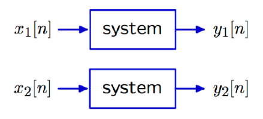
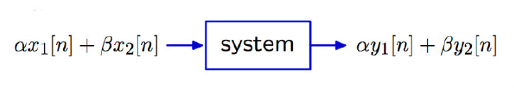
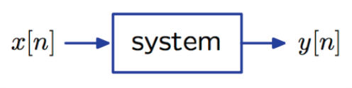
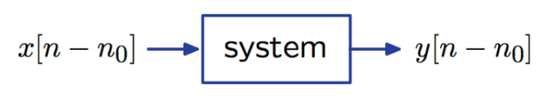

# VE216 Lecture 8

>   Convolution

## Convolution

Hoping to represent a system by a single signal, while the input is more complicated.

## Superposition

Breaking input into additive parts and sum the responses to the parts.

It is easy if system is **linear and time-invariant (LTI)**.

### Linear

Given 

and the system is linear if 

for all $\alpha, \beta$.

### Time-Invariance

Given 

and the system is time invariant if 

for all $n_0$.

### Structure of Superposition

$\begin{aligned}\delta[n] &\to h[n]\\\delta[n-k] &\to h[n-k]\\x[k]\delta[n-k] &\to x[k]h[n-k]\\x[n] = \sum^{+\infty}_{k=-\infty} x[k]\delta[n-k] &\to y[n] =  \sum^{+\infty}_{k=-\infty}x[k]h[n-k]\end{aligned}$

## Convolution Notation

$x[n] \to \text{LTI System} \to y[n]$

$\begin{aligned}y[n] = \sum^{+\infty}_{k=-\infty}x[k]h[n-k] = (x *h)[n] \end{aligned}$

## DT Convolution Remark

Actually, unit sample response $h[n]$ is a complete description of an **LTI system**.

## CT Convolution

Similar form: $\begin{aligned}x(t) &\to \int^{\infty}_{-\infty}x(\tau)\delta(t-\tau)d\tau\\y(t) &\to \int^\infty_{-\infty}x(\tau)h(t-\tau)d\tau \end{aligned}$

## Convolution Summary

DT: $\begin{aligned}y[n] = \sum^{+\infty}_{k=-\infty}x[k]h[n-k] = (x *h)[n] \end{aligned}$

CT: $\begin{aligned}y(t) =\int^\infty_{-\infty}x(\tau)h(t-\tau)d\tau= (x *h)(t) \end{aligned}$

## Summary

The **impulse response** is a **complete description** of a **linear, time-invariant (LTI) system**.

One can find the output of such a system by **convolving the input signal with the impulse response**.