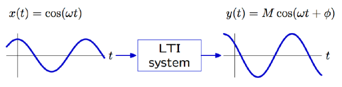
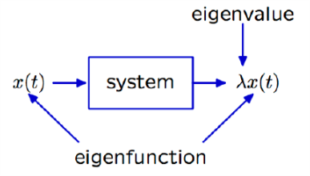
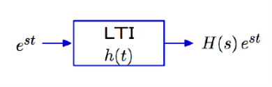
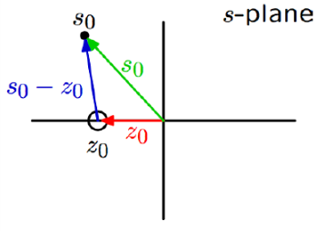

# VE216 Lecture 9

>   Frequency Response

## Frequency Response

A different way to characterize a system.

Previously we learnt to use **unit-sample/impulse response**.

If the input to **LTI system** is a **eternal sinusoid**, the output is also a **eternal sinusoid**

-   same **frequency**
-   possibly different **amplitude** and **phase angle**

## Calculation Method

Eigenfunction and eigenvalues.

If **output signal** is a **scalar multiple** of **input signal**, then signal is **eigenfunction** with multiplier as **eigenvalue**.

## Complex Exponentials

**Complex exponentials** are eigenfunctions of LTI systems.

$x(t) = e^{st}$and $h(t)$ is impulse response, then:

$(h*x)(t) = \int^\infty_{-\infty} h(\tau)e^{s(t-\tau)}d\tau = e^{st}\int^\infty_{-\infty}h(\tau)e^{-s\tau}d\tau = H(s)e^{st}$

$cos\omega_0t = \frac 1 2(e^{j\omega_0t}+e^{-j\omega_0t})$

## Vector Diagrams

$H(s_0) = K \frac{(s_0 - z_0) (s_0 - z_1)(s_0 - z_2) \cdots}{(s_0 - p_0) (s_0 - p_1)(s_0 - p_2) \cdots}$

So it can be represented into vector form 

$|H(s_0)| = |k|\frac{|(s_0 - z_0)|| (s_0 - z_1)||(s_0 - z_2)| \cdots}{|(s_0 - p_0)|| (s_0 - p_1)||(s_0 - p_2)| \cdots}$

$\angle H(s_0) = \angle K + \sum \angle (s_0 - z_k) - \sum\angle (s_0-p_k)$

## Frequency Response with Vector Diagram

$\begin{align}y(t) &= \frac12(H(j\omega_0)e^{j\omega_0t} + H(-j\omega_0)e^{-j\omega_0t}) \\&= Re\{H(j\omega_0)e^{j\omega_0t}\} \\&=Re\{|H(j\omega_0)|e^{j\omega_0t+j\angle H(j\omega_0)}\}\\&= |H(j\omega_0)|cos(\omega_0t+\angle H(j\omega_0))\end{align}$

## Remark

Frequency response lives on the $j\omega$ axis of the Laplace transform.